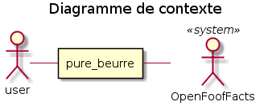
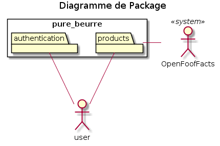
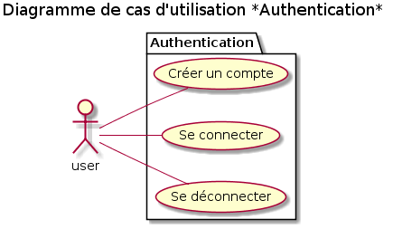
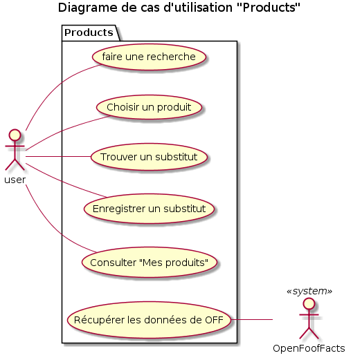
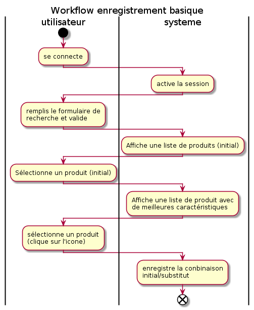
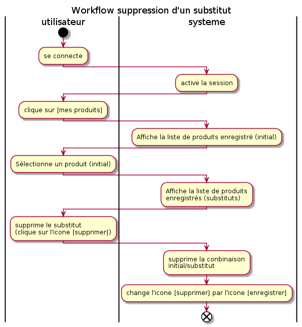
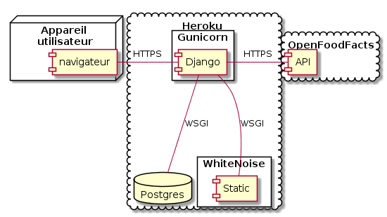
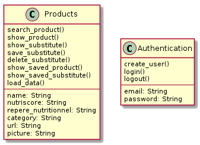
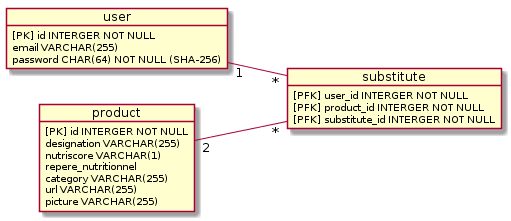
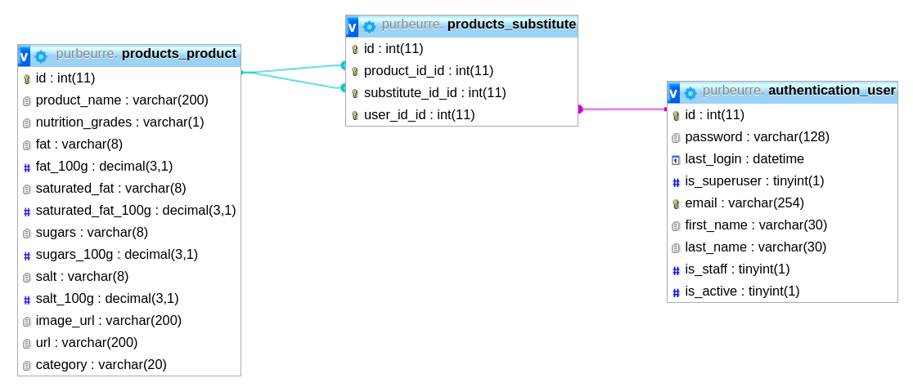

# Analyse fonctionnelle

## Contexte

La startup Pur Beurre souhaite faire une application en ligne à partir du précédent projet ([oc_dapython_pr5](https://github.com/Zepmanbc/oc_dapython_pr5/)).

Il faut fournir une application web permettant de sélectionner le substitut d'un aliment qui sera jugé plus sain.

## 1. - User stories

* **En tant que** Lily Kala **je veux** trouver un produit de substitution en un clic **afin de** ne pas perdre de temps
* **En tant que** Lily Kala **je veux** savoir où me procurer le produit de substitution **afin de** ne pas perdre de temps
* **En tant que** Pur beurre **je veux** connaitre l'adresse des utilisateur **afin de** pouvoir les prévenir de mises à jours
* **En tant que** Lily Kala **je veux** sélectionner les produits sur les critères bon et donne de l'énergie **afin d'** aller à l'essentiel (pas besoin du visuel)
* **En tant que** utilisateur **je veux** trouver un aliment qui a une bonne note sur OFF **afin que** la nourriture que je mange soit meilleure pour ma santé
* **En tant que** utilisateur **je veux** retrouver les recherches que j'ai déjà effectuées **afin que** je ne perde pas de temps à recommencer la recherche

## 2. - Règles fonctionnelles

L'utilisateur pourra créer un compte afin de sauvegarder les combinaisons d'aliments.

L'utilisateur doit pouvoir choisir un substitut en 1 clic.

L'utilisateur fait une recherche textuelle, il sélectionne le produit qu'il consomme actuellement, une liste de substitut lui est proposé, il peut les consulter et les enregistrer en association avec le produit initial.

Les associations sont sauvegardées et consultable.

Une évolution est prévue de pouvoir commander un produit directement depuis le site et toucher une commission.

## 3. - Acteurs système

## 4 - Décomposition du système

## 5 - Les cas d'utilisation

* [A01 - Créer un compte](fiches/A01.md)
* [A02 - Se connecter](fiches/A02.md)
* [A03 - Se déconnecter](fiches/A03.md)

* [P01 - Faire une recherche](fiches/P01.md)
* [P02 - Choisir un produit](fiches/P02.md)
* [P03 - Trouver un substitut](fiches/P03.md)
* [P04 - Enregistrer un substitut](fiches/P04.md)
* [P05 - Afficher un produit](fiches/P05.md)
* [P06 - Supprimer un substitut](fiches/P06.md)
* [P07 - Consulter "Mes produits"](fiches/P07.md)
* [P08 - Consulter les substituts enregistrés](fiches/P08.md)
* [P09 - Récupérer les données de OFF](fiches/P09.md)

## 6 - Parcours

## 7 - Solution Technique

## 8 - Diagramme de classe

## 9 - Modéle physique de données

Le résultat des models:

